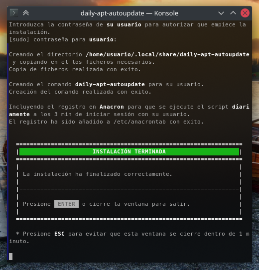

# Actualización automática con APT

Este es un pequeño programa para automatizar las actualizaciones a través del gestor de paquetes APT con el objetivo de facilitarle la tarea a usuarios poco experimentados o que no quieran preocuparse por tener que pasar manualmente las actualizaciones del sistema y sin embargo quieran gestionarlas mediante APT.

\* Debería funcionar sin problemas con cualquier derivado de Debian / Ubuntu o simplemente cualquier distribución GNU/Linux con _APT_ y _Anacron_ instalados.

<br />

**TABLA DE CONTENIDO**
+ [Descripción](#DESCRIPCIÓN)

+ [Instalación](#INSTALACIÓN)
  
  - [Instalación manual](#INSTALACIÓN-MANUAL)

+ [Desinstalación](#DESINSTALACIÓN)
  
  - [Desinstalación manual](#DESINSTALACIÓN-MANUAL)

____

## DESCRIPCIÓN

Una vez al día, 3 min después de iniciar sesión con su usuario, le aparecerá una ventana de terminal mostrándole el proceso de las actualizaciones.

Si el proceso se lleva a cabo sin problemas le mostrará un letrero informándole de ello y se cerrará la ventana tras 20 segundos a menos que presione **ESC** para suspender el temporizador y mantenerla abierta. Tanto si desea cerrar la ventana antes de los 20 segundos como si ha presionado ESC para que no se cierre, podrá simplemente pulsar **Enter** para salir cuando haya terminado.

En caso de que haya sucedido algún problema, se le mostrará un letrero informándole  donde ha fallado y la ventana permanecerá abierta hasta que usted pueda ver el mensaje y pulse **Enter** o la cierre.

Si desea ejecutar el programa de forma manual puede escribir el comando **daily-apt-autoupdate** en una ventana de terminal.

En la carpeta del programa (_~/.local/share/daily-apt-autoupdate_) encontrará también el fichero auto-generado **activity.log** con el registro de las últimas 30 ejecuciones del programa y en caso de fallo una corta descripción de la causa.

**NOTA:** En caso de que haya más de un usuario en su sistema, tenga en cuenta que se  programará la ejecución únicamente para los usuarios que hayan instalado el programa. Puede instalarlo sin problemas para más de un usuario teniendo en cuenta que, al menos durante el proceso de instalación, el usuario deberá tener permisos de administrador (sudo) para poder programar la tarea con _Anacron_ en su sistema.

<br />

<p align="center">
   
</p>

<br />

## INSTALACIÓN

Para instalar el programa descargue el [fichero zip](https://github.com/FenrirWolfwood/daily-apt-autoupdate/archive/refs/tags/V1.1.0.zip), descomprímalo y ejecute el fichero **install.sh** simplemente haciendo doble clic sobre el, desde el menú contextual, o desde una terminal.

A continuación se le abrirá una nueva ventana de terminal pidiéndole confirmación. Para continuar seleccione **<span style="color:lightgreen">Si</span>** y pulse **Enter**, o use los cursores **⇧** y **⇩** para cambiar la selección a **<span style="color:red">No</span>** si desea salir.

Seguidamente le pedirá que escriba la contraseña de **su usuario** para autorizar el proceso de instalación.

<br />

<p align="center">
   
</p>

<br />

Tras escribir su contraseña, se creará una carpeta en su usuario en _~/.local/share/daily-apt-autoupdate_, se copiarán todos los ficheros en ella y se programará en _Anacron_ que se pasen las actualizaciones del sistema diariamente para su usuario. Si todo ha ido bien, le mostrará un mensaje informándole de ello y pasado un minuto se cerrará la ventana si no la ha cerrado usted antes.

Si desea revisar el proceso puede pulsar **ESC** para evitar que la ventana se cierre.

\* En la ventana de actualizaciones, el tiempo de espera antes de que se cierre sola si no pulsa **ESC**, es de 20 segundos para que no resulte molesta al tratarse de un proceso diario.

<br />

<p align="center">
   
</p>

<br />

En el caso de que hubiera algún problema con la instalación, se borrarán los cambios que se hayan hecho y le saldrá un mensaje informándole de cual ha sido el problema. En este caso la ventana permanecerá abierta hasta que usted pueda ver el mensaje y pulse **Enter** o la cierre.

<br />

<p align="center">
   
</p>

<br />

### INSTALACIÓN MANUAL

En el caso de que el script de instalación no le funcione o simplemente prefiera hacer una instalación personalizada, la instalación manual es bien sencilla.

1. Descargue el [fichero zip](https://github.com/FenrirWolfwood/daily-apt-autoupdate/archive/refs/tags/V1.1.0.zip) y descomprímalo.

2. Cree usted mismo la carpeta **~/.local/share/daily-apt-autoupdate** u otra carpeta donde usted prefiera.

3. Copie todos los ficheros en dicha carpeta y asegúrese de que el fichero **daily-apt-autoupdate.sh** sea ejecutable.

4. Para programar la tarea en **Anacron** deberá ejecutar lo siguiente desde su terminal de comandos, le pedirá la contraseña de su usuario para autorizar el cambio:
   
   ```bash
   source ~/.local/share/daily-apt-autoupdate/assets/default-term.sh
   echo -e "1  3   daily-apt-autoupdate-$USER  export DISPLAY=$DISPLAY XAUTHORITY=$XAUTHORITY HOME=$HOME USER=$USER GROUP=$(id -gn) && $default_term $HOME/.local/share/daily-apt-autoupdate/daily-apt-autoupdate.sh &" | sudo tee -a /etc/anacrontab > /dev/null
   ```
   
   **IMPORTANTE:** Si ha decidido utilizar una carpeta distinta de _~/.local/share/daily-apt-autoupdate_ tendrá que cambiar la ruta de la carpeta en estos comandos.

5. OPCIONAL: Si lo desea, puede crear un comando de terminal para su usuario creando un enlace al fichero _daily-apt-autoupdate.sh_ en la carpeta _~/.local/bin_ y ejecutar el script de forma manual cuando lo desee simplemente escribiendo el comando **daily-apt-autoupdate** en su terminal.
   
   \* Puede ser necesario crear la carpeta _~/.loclal/bin_ y reiniciar su sesión de usuario para que el comando esté disponible.
   
   ```bash
   sudo ln -s ~/.local/share/daily-apt-autoupdate/daily-apt-autoupdate.sh ~/.local/bin/daily-apt-autoupdate   
   ```

Con estos pasos la instalación estaría terminada y ya puede borrar los ficheros descargados ya que en caso de necesitar alguno de ellos los encontrará en la carpeta donde los ha copiado usted mismo , incluido este manual. (_~/.local/share/daily-apt-autoupdate_).

<br />

## DESINSTALACIÓN

Si decide utilizar los servicios de actualización automática que le ofrezca su distribución GNU/Linux o tal vez encargarse usted mismo de ello, puede desinstalar este programa simplemente ejecutando el script **uninstall.sh** y siguiendo los pasos al igual que con el de instalación.

Este script eliminará la carpeta _~/.local/share/daily-apt-autoupdate_ junto con su contenido y borrará la tarea programada creada en _Anacron_.

Igual que en la instalación, si todo ha ido bien le mostrará un mensaje informándole de ello y se cerrará la ventana pasado un minuto si no la ha cerrado usted antes.

\* Si desea revisar el proceso puede pulsar **ESC** para evitar que la ventana se cierre.

En el caso de que hubiera algún problema con la desinstalación, le saldrá un mensaje informándole de cual ha sido el problema y la ventana permanecerá abierta hasta que usted pueda ver el mensaje y pulse **Enter** o la cierre.

<br />

### DESINSTALACIÓN MANUAL

En el caso de que el script de desinstalación no le funcione o haya realizado una instalación manual personalizada, la desinstalación es simplemente invertir los pasos de la instalación:

1. Borre la carpeta creada en **~/.local/share/daily-apt-autoupdate** o la correspondiente en caso de que la haya creado manualmente en otro sitio.

2. Edite el fichero **/etc/anacrontab** y borre la linea correspondiente a **daily-apt-autoupdate** asociada a su usuario. Si lo ha instalado para más usuarios el programa seguirá ejecutándose para esos usuarios sin verse afectado.

3. En el caso de que haya realizado la instalación mediante el script o bien decidiera crear el comando al realizar la instalación manual, no se olvide también de borrar el enlace creado en el directorio **~/.local/bin** llamado **daily-apt-autoupdate**.

Con estos pasos habrá borrado correctamente los ficheros y configuraciones relacionados con este programa.
